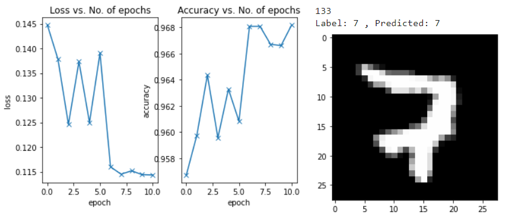
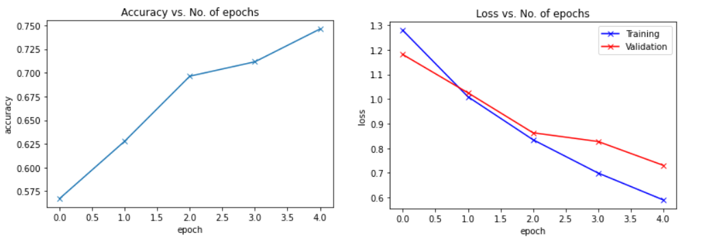
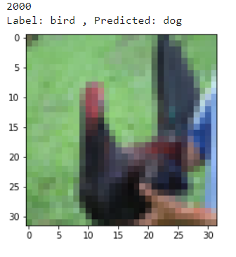
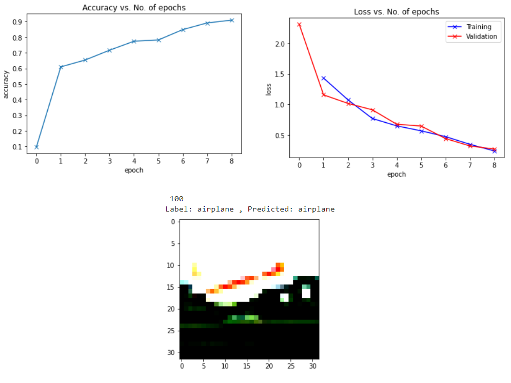

  
  <h1 align="center">Image Classification</h1>

  
Table of Contents

  <ol>
    <li>
      <a href="#about-the-project">About The Project</a>
    </li>
    <li>
      <a href="#Phases">Phases</a>
      <ul>
        <li><a href="#Phase1">Simple Neural Network for MNIST dataset</a></li>
        <li><a href="#Phase2">Convolutional Network for cifar10 dataset</a></li>
        <li><a href="#Phase3">ResNet for cifar10 dataset</a></li>
      </ul>
    </li>
    <li><a href="#contact">Contact</a></li> 
  </ol>

## About The Project
This project implements three types of networks with `PyTorch` and uses the `cifar10` and `MNIST` Dataset for training and testing model.

## Phases  

<h3 id="Phase1">Simple Neural Network</h3>  

In this phase network is designed for `MNIST` dataset. Finall accuracy is 0.9682.  
All further information about architecture of models and results are saved in the notebook.  

<h3 id="Phase2">Convolutional Neural Network</h3>  

In this phase network is designed for `cifar10` dataset. Finall accuracy is 0.7462.  
All further information about architecture of models and results are saved in the notebook.  

 
 
it does not work well :(  

<h3 id="Phase3">ResNet</h3>  

In this phase network is designed for `cifar10` dataset. Finall accuracy is 0.9090.  
All further information about architecture of models and results are saved in the notebook.  

## Contact
[Amirreza Naziri](https://github.com/Amir79Naziri)  
Email: naziriamirreza@gmail.com  

(<a href="#top">back to top</a>)

